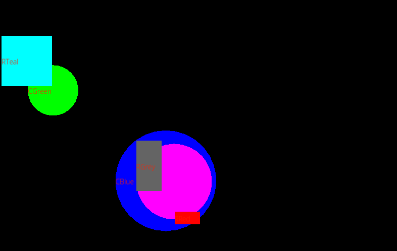

# project1

This is a simple project, which uses C++ and SFML to implement
obuncing shapes. These shapes have fill color, names, and different
geometries as specified in the config file `config.txt`.

It's my first step into gameDev

| Config file Format              | Expanded Format (explained)                                                      |
| ------------------------------- | -------------------------------------------------------------------------------- |
| Window W H                      | -> Window width height                                                           |
| Font F S R G B                  | -> Font relativePath Size Red Green Blue                                         |
| Rectangle N X Y vX vY R G B W H | -> Rectangle Name x(float) y(float) vx(float) vy(float) R G B(ints) W H(floats)  |
| Circle N X Y vX vY R G B R      | -> Circle Name x(float) y(float) vx(float) vy(float) R G B(floats) radius(float) |
